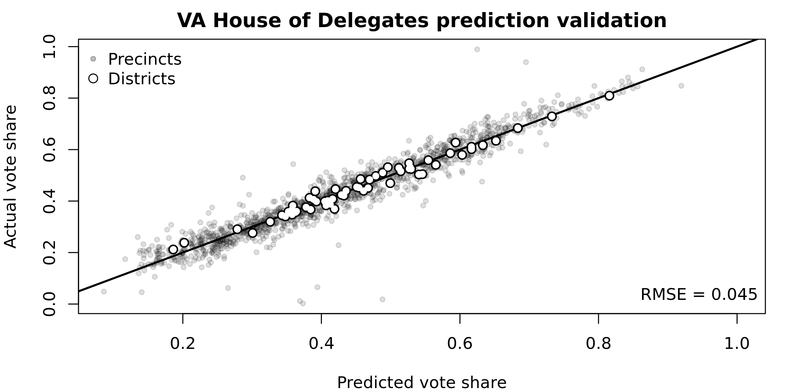

PlanScore Model Generator
===

PlanScore bases its scores on predicted precinct-level votes for each office:
State House, State Senate, and U.S. House. We generate these predicted votes
using political variables entered into the ordinary least squares regression
model in [`run_planscore_model.R`](run_planscore_model.R).

To predict turnout we regress total major-party vote for the race in question
on total major-party presidential vote. To predict vote share we regress the
Democratic share of the major-party vote on the Democratic share of the
major-party presidential vote. Using the coefficients and standard errors from
these models, we then generate 1000 simulated total votes and Democratic vote
shares for each precinct. These numbers are the inputs for calculating 1000
sets of efficiency gaps, partisan biases, and mean-median differences, which
produce the means and margins of error reported on
[PlanScore.org](https://planscore.org).

Input Data File
---

Sample input data is included in the CSV file
[`Virginia Precinct-Level Results - House of Delegates 2017.csv`](Sample/Virginia-Precinct-Level-Results-House-of-Delegates-2017.csv).

Required columns include:

- `cntyname` (string) - County name
- `precinct` (string) - Precinct name
- `psid` (string) - Geography ID
- `v.d` (integer) - Raw Democratic votes for office in question
- `v.d` (integer) - Raw Republican votes for office in question
- `us.pres.d` (integer) - Raw Democratic presidential votes
- `us.pres.r` (integer) - Raw Republican presidential votes
- `incumb` (string) - Incumbency, coded `"D"`, `"R"`, `"D;R"` for multiple-district precincts, or empty for open seat
- `district` (string) - District number or `"X;Y"` for multiple-district precincts

Running the Model
---

Start by [installing Docker for your system](https://docs.docker.com/), a way
to run applications securely isolated in a container.

Next, prepare an image with [R](https://www.r-project.org) (free software
environment for statistical computing and graphics) and required libraries:

    docker build -t planscore-r:latest .

Finally, run the model script with three arguments: a CSV input file, the
postal abbreviation of the state, and the name of the legislative chamber:

    docker run -v `pwd`:/vol --rm -it planscore-r:latest run-planscore-model.sh \
        "/vol/Sample/Virginia-Precinct-Level-Results-House-of-Delegates-2017.csv" \
        "VA" "House-of-Delegates"

Output will include five files, each with estimates for 1,000 simulated elections:

- `{state,chamber}_turnout.csv` - Expected voter turnouts *divided by 100*
- `{state,chamber}_open.csv` - Expected Democratic vote share for open seats
- `{state,chamber}_incD.csv` - Expected vote swing toward a Democratic incumbent
- `{state,chamber}_incR.csv` - Expected vote swing toward a Republican incumbent
- `{state,chamber}.png` - Graph showing predicted vs. actual votes for verification

